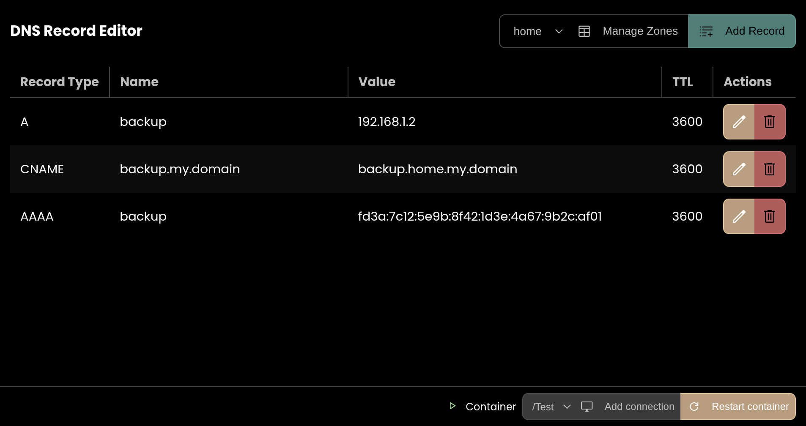

# DNS Editor

A docker-based editor for DNSMasq configuration.

## Features

- [x] Zone Editor
- [x] Record Editor
- [x] Container discovery
- [ ] Docker API Authentication

## Getting Started

### Enabling the Docker API

This app can run entirely from a static file server. Therefore, it requires an HTTP-backed Docker API. This can be
achieved in two ways:

- Configure Docker to listen on a TCP
  socket. [See the official instructions on how to do this](https://docs.docker.com/engine/daemon/remote-access/#enable-remote-access).
- Configure the app server to reverse-proxy the Docker API to a TCP socket. This repo includes a Caddy configuration
  which does this. [See it for examples](./Caddyfile).

> **Note**: Docker explicitly advises against this for good reason. The Docker API is an extremely powerful API.
> 
> For this reason, I am working on an authenticated proxy for this and other similar applets I'm working on. I'm
> planning on putting an OpenID-Connect authentication step between the network and the reverse proxy. This is the
> intended purpose of the _Require Authentication_ checkmark in the connection dialogue. While it is not implemented
> yet, it is a top priority. 
>
> In the meantime, please please please do your due dilligence of firewalling your API and protecting it properly if
> you plan on using this app productively. 

### Running the app

Since the application does not require a backend, you shouldn't need to run it yourself. But if you want to, you can
download the built version from the [releases page](https://github.com/j-cake/dnsmasq-frontend/releases) and configure
your web server to serve it. Again, see the [Caddyfile](./Caddyfile) for an example.

### Building the app

1. Install dependencies with `npm install`.

2. The app can be built using `npm run build`. This produces a development build in the `build` directory. This
   directory can be served as-is. For a production build, run `npm run build:prod`. It will replace the contents of the
   `build` directory with a production build.

### Connecting to a container

When you open the app, you need to connect to a container. The `Connect to container` button will guide you through the
process of locating the container. Paste the URL to the **base** of the Docker API. (For example, if your Docker API is
running on `http://localhost:2375/local`, you should paste `http://localhost:2375/local`. The app will query
`http://localhost:2375/local/containers/json` to get a list of containers).

When you choose the container/s you wish to connect to, each will be enumerated for the available DNS zones. You can
freely choose between them. They are divided by the container they belong to.

### DNS Zones

DNS Zones are discussed throughout the app as a configuration file. They are stored in the container's `/etc/dnsmasq.d`
directory. By parsing/serialising the configuration files, the app can provide a visual representation of the zones.

> **Note:** The app does no form of backup/write protection **yet**. Be careful!
